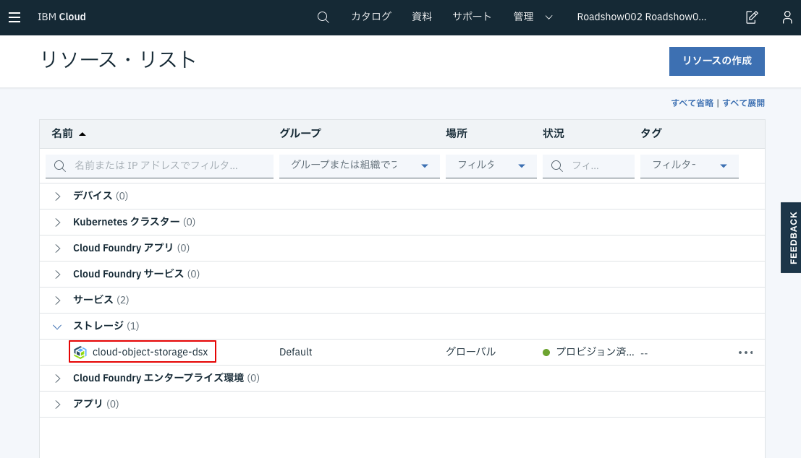
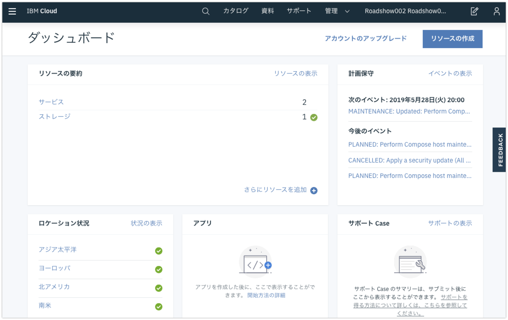

Cloud Object Storageインスタンスを作成すると、トレーニングデータを保存するための信頼できる場所が得られます。また、データの収集とコラボレーションの可能性を広げ、ユーザーデータを収集し、専門家チームが簡単にラベルを付けることを可能にします。

IBM Cloudは、無料の25 GBのストレージを含む、軽量のオブジェクト・ストレージを提供します。 （これがチュートリアルを通して使われます）

Cloud Object Storageのインスタンスを作成するためには、まずは[IBM Cloud](https://ibm.biz/BdzEui)に **ログイン** または **サインアップ(アカウント未作成の方)** してください。

ログインすると、IBM Cloudダッシュボードが表示されるはずです。これが、IBM Cloudリソースを作成および管理できる場所です。

>なお **Watson Studioなどでライトプランでオブジェクトストレージを作成済みの場合** は、ライトプランでは1つのインスタンスしか作成できないため、作成済みのオブジェクトストレージを使用します。以下の新規作業は不要です。
>ダッシュボードから「リソースの表示」→「ストレージ」をクリックし、表示されたオブジェクトストレージをクリック後、**資格情報**のステップに進んでください。<br/>
>

新しいCloud Object Storageインスタンスを作成するには、まず **リソースの作成** ボタンをクリックします。<br/>



左側のカテゴリーからストレージを選択し、 表示された**オブジェクト・ストレージ** をクリックします。<br/>


価格プランを選択し、**作成** をクリックします。


## 資格情報
オブジェクトストレージインスタンスを作成したら、IBM Cloudの外部からデータにアクセスできるようにする必要があります。このためには自分のリソースに対して資格情報を作成する必要があります。<br/>

左側のメニューから、**サービス資格情報**をクリックし、**新規資格情報**ボタンをクリックします。<br/>


役割が**Writer**になっていることを確認し、**Include HMAC Credential**にチェックを入れ、「インラインの構成パラメーターの追加 (オプション)」 に以下が表示されていることを確認後、**追加**ボタンをクリックしてください。<br/>
```
{"HMAC": true}
```


追加が完了したら、追加した資格情報の**資格情報の表示**のドロップダウンをクリックし、**apikey**, **access_key_id**, **secret_access_key**, **resource_instance_id**の4つをテキストファイル等にコピーしておいてください。<br/>


<pre>
{
  <b>"apikey": "...",</b>
  "cos_hmac_keys": {
    <b>"access_key_id": "...",</b>
    <b>"secret_access_key": "..."</b>
  },
  "endpoints": "...",
  "iam_apikey_description": "...",
  "iam_apikey_name": "...",
  "iam_role_crn": "...",
  "iam_serviceid_crn": "...",
  <b>"resource_instance_id": "..."</b>
}
</pre>
