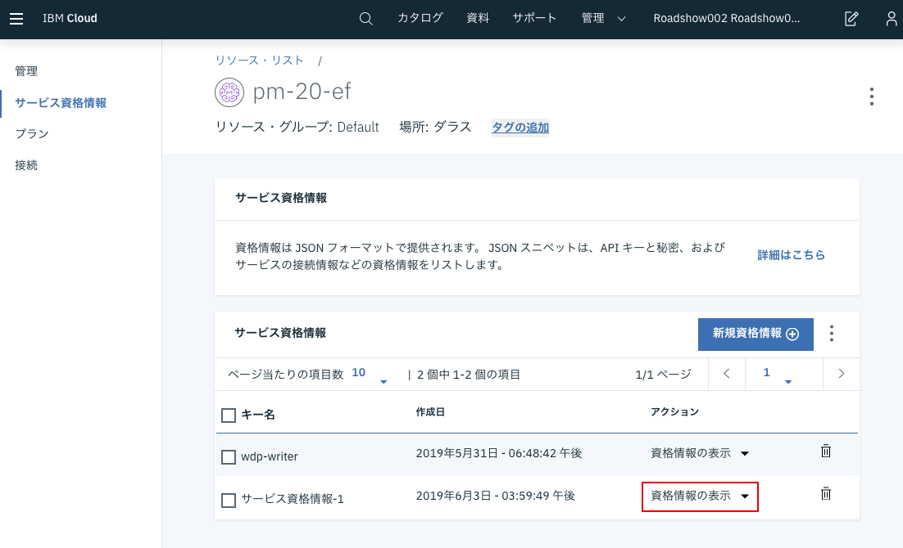

Watson Machine Leaningインスタンスを作成することで、専門のインフラストラクチャで機械学習モデルをトレーニング、展開、およびテストするための信頼できる場所が得られます。これにより、複数のハイエンドGPUを利用して、複数の実験を同時に開始することができます。Watson Machine Learningは、TensorFlow、Keras、Caffe、PyTorch、Spark MLlib、scikit learn、xgboost、およびSPSSなどの幅広い機械学習フレームワークをサポートしています。IBM Cloudは、月額50時間の無料計算を含む、Watson Machine Leaningのライトプランを提供します。 （これがチュートリアルを通して使われるものです）

Watson Machine Learningインスタンスを作成するには、まず [IBM Cloud Dashboard](https://ibm.biz/BdzEui) に戻り、**リソースの作成** ボタンをクリックします。 

左側のカテゴリーからAIを選択し、 表示された**Machine Learning** をクリックします。 

価格プランを選択し、**作成** をクリックします。
> **注意** ここで使用するクラウドアノテーションは「ダラス」と「ロンドン」の地域でのみサポートされているサービスとしてのディープラーニングに依存していますので、デプロイする地域は「ダラス」を選択してください。 

## 資格情報
Watson Machine Learningインスタンスを作成したら、IBM Cloudの外部からデータにアクセスできるようにする必要があります。このためには自分のリソースに対して資格情報を作成する必要があります。 

左側のメニューから、**サービス資格情報**をクリックし、**新規資格情報**ボタンをクリックします。 

役割が**Writer**になっていることを確認し、**追加**ボタンをクリックしてください。 

追加が完了したら、追加した資格情報の**資格情報の表示**のドロップダウンをクリックし、
**instance_id**, **password**, **url**, **username**の4つをテキストファイル等にコピーしておいてください。 

<pre>
{
  "apikey": "...",
  "iam_apikey_description": "...",
  "iam_apikey_name": "...",
  "iam_role_crn": "...",
  "iam_serviceid_crn": "...",
  <b>"instance_id": "...",</b>
  <b>"password": "...",</b>
  <b>"url": "...",</b>
  <b>"username": "..."</b>
}
</pre>
