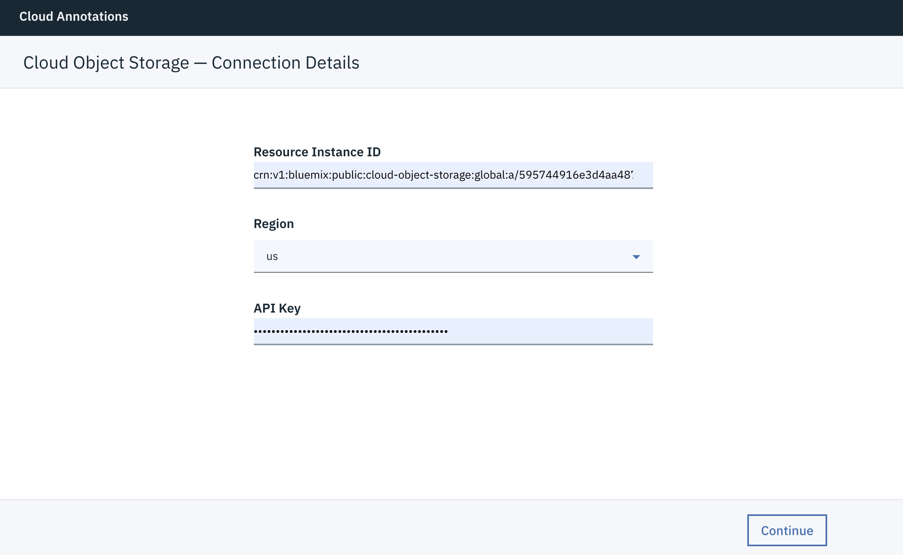
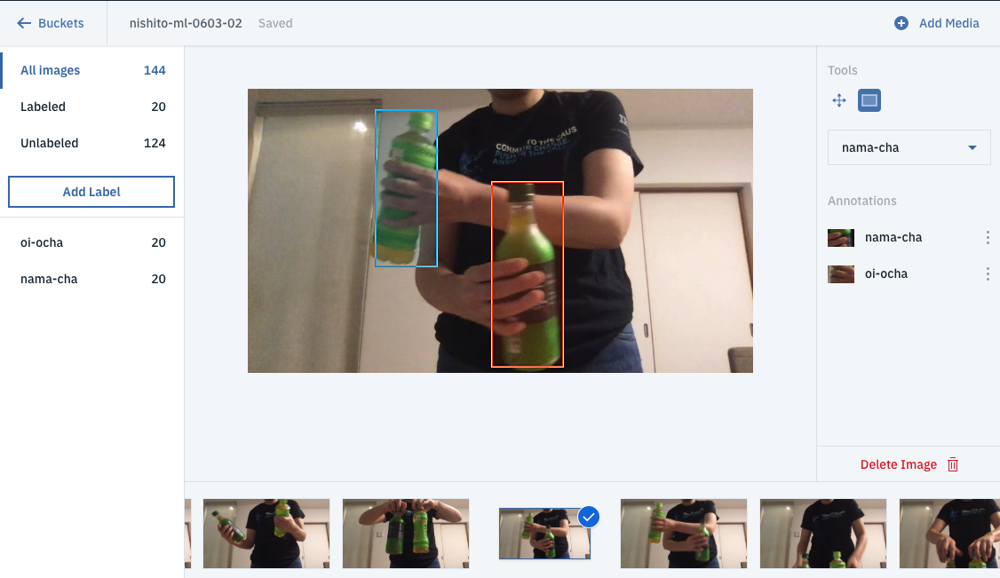

オブジェクト検出をするので、準備するデータは関連する境界ボックスのアノテーション(タグ付きデータ)を持つ画像からなるでしょう。

自分のオブジェクト・ストレージ・バケットにアノテーションを簡単に作成するために、[Cloud Annotations Tool](https://cloud.annotations.ai) を使用することができます。これは、オブジェクトストレージの上に配置され、写真をアップロードしてアノテーションを関連付けることができるWeb GUIです。

このツールを使用するには、[Cloud Annotations Tool](https://cloud.annotations.ai) に移動して、オブジェクト・ストレージの資格情報を追加するだけです。

[Cloud Annotations Tool](https://cloud.annotations.ai) にアクセスし、
[「オブジェクト・ストレージ インスタンスの作成」](2.html)でメモした資格情報を下記の画面に入力します。Reagionは`us`のままでOKです。その後`Continue`をクリックしてください。

ファイルとアノテーションを**バケット**と呼ばれるものに保存します。**Create bucket**をクリックして作成できます。
>**注意** 作成する**Bucket name**は以下のルールに従う必要があります。
>- **IBM Cloud Object Storage システム全体で固有である必要があります (ユーザー名と同様)**。
>- 個人情報 (名前、住所、金融またはセキュリティーの口座、SSN の一部) を使用してはいけません。
>- 先頭文字と最終文字は英数字にする必要があります (3 から 63 文字)。
>- 小文字、数字、連続していないドットとハイフンが使用できます。  

バケットを作成して名前を付けると、アノテーションの種類を選択するように求められます。 **Localization**を選択する必要があります。これにより、画像上に境界ボックスの長方形を描くことができます。

## トレーニングデータのベストプラクティス

* 私たちがトレーニングするモデルは、現実世界の物体の写真に最適化されています。レントゲン写真、手描き、スキャンされた文書、領収書などにはうまく機能しません。

* トレーニングデータは、予測が行われるデータにできるだけ近いものにする必要があります。たとえば、ユースケースにぼやけて低解像度の画像が含まれている場合（防犯カメラなど）、トレーニングデータはぼやけて低解像度の画像で構成する必要があります。一般に、トレーニング画像に複数の角度、解像度、および背景を設定することも検討する必要があります。

* 私たちが訓練するモデルは一般的に人間が割り当てることができないラベルを予測することはできません。そのため、人間が1〜2秒間画像を見てラベルを割り当てるように訓練することができない場合、モデルはそれを行うように訓練することができない可能性があります。

* 使用可能なモデルについては、ラベルごとに少なくとも50のトレーニング画像をお勧めしますが、100または1000を使用するとより良い結果が得られます。

* 私たちがトレーニングするモデルは300 x 300ピクセルに画像のサイズを変更するので、ある寸法が他の寸法よりもはるかに長い画像でモデルを訓練するときには注意が必要です。

## データにラベルづけを行う
イメージにラベルをつける方法:
1. 動画または多くの画像をアップロードします。(動画のフォーマットはmp4です)
2. 分類したいラベルを定義します。
3. 境界ボックスの長方形を描いていきます。

## &nbsp;
> **📁 [Sample Training Data](https://ibm.box.com/v/ocha-training)** 生茶とおーいお茶の動画
