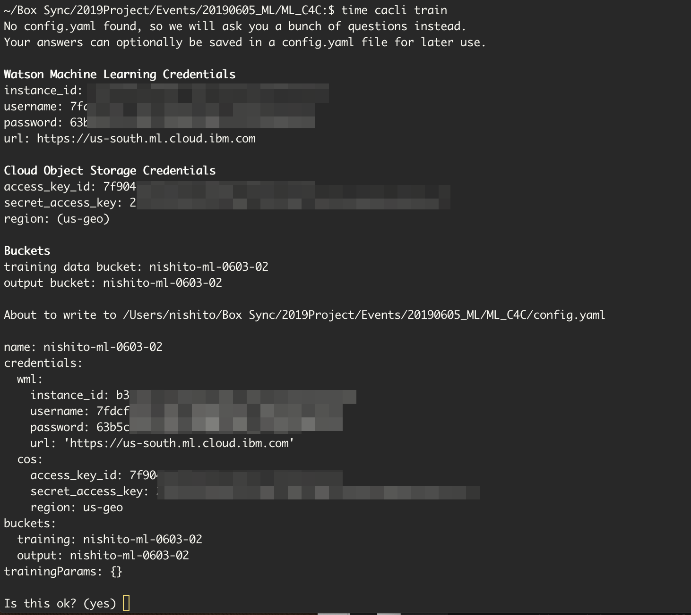
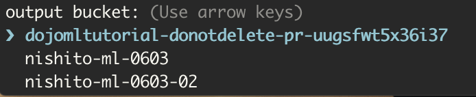
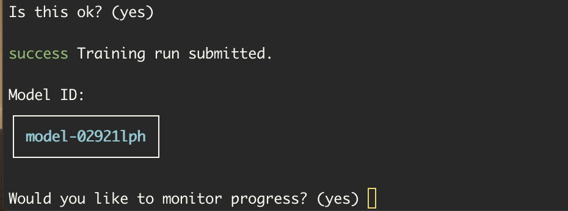
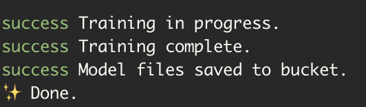

1回目の画像を収集してラベルを付けたので、モデルのトレーニングを開始する準備が整いました!

ターミナル(コマンドウィンドウ)を開いてください。

## インストール

モデルをトレーニングするには、Cloud Annotation CLIをインストールする必要があります:
```bash
npm install -g cloud-annotations
```
> **注：Node10.13.0以降がインストールされている必要があります。**  異なるプロジェクト間でNodeのバージョンを簡単に切り替えるには [nvm](https://github.com/creationix/nvm#installation) (macOS/Linux) または[nvm-windows](https://github.com/coreybutler/nvm-windows#node-version-manager-nvm-for-windows) を使うことができます。

## WMLにトレーニングの実行をSubmitする 
私たちがトレーニングするモデルはSSD MobileNetアーキテクチャです。 SSD MobileNetモデルはファイルサイズが非常に小さく、精度をほとんど犠牲にすることなく非常に素早く実行できるため、ブラウザでの実行に最適です。

モデルをトレーニングしていると言うと、技術的にはモデルをトレーニングし直していることになります。私たちがトレーニングしているモデルはすでにアヒルから飛行機まで及ぶ何百万もの画像と何千ものカテゴリーについてトレーニングされています。これは基本的なエッジや形のようなモデルのアイデアを教えるのに役立ち、私たちが少しのトレーニングデータで私たちが必要とするものについてトレーニングすることを可能にします。

トレーニングをスタートするには、次のコマンドを実行します: 
```bash
cacli train
```
> 下記のようにWatson Machine LearningとCloud Object Storageの資格情報の入力を求められますので、入力してください。<br/>
 
> 下記のようにバケット名の選択の指示が表示されたら、矢印キーで今回作成したバケット名を選択してください。<br/>
 
<br/>
> `region: (us-geo)`のようにカッコでデフォルト値が表示されているものは何も入力せずにEnterを押してください。<br/>
> `success Training run submitted.`と表示されると**Model ID**が表示されます。モデルのダウンロードに必要ですのでどこかにメモしておいてください。<br/>
 
<br/>

> **注:** `cacli progress <model_id>`を実行することでいつでもトレーニングの実行をモニタできます。

トレーニングには30分程度かかります。

トレーニングの実行をモニタしていた場合、完了すると下記のようなメッセージが表示されます。


## モデルのダウンロード
モデルのトレーニングが完了したら、モデルをダウンロードできます。モデルをダウンロードしてください:
>`<model_id>`は`success Training run submitted.`と表示された時に表示された**Model ID**と置き換えてください。
```bash
cacli download <model_id>
```

これはTensorFlowグラフから `model_ *`ディレクトリをダウンロードします。これは作成するアプリで使用するものです。

> cacliコマンドの使い方、オプションの詳細は[こちら](https://github.com/cloud-annotations/cloud-annotations-cli) を参照してください。

